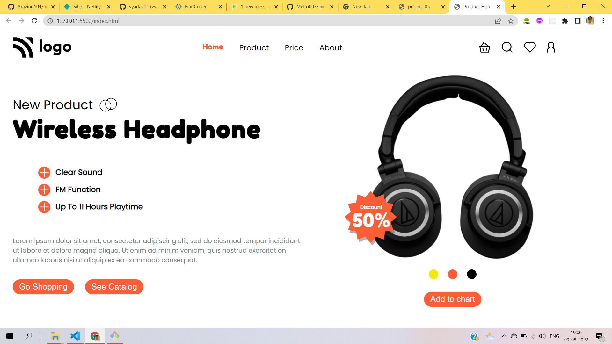

# :smiley: Hi !! I'm Aravind

In this project i used below `tech stack` to build headphone selling company static landing page

- HTML5
- CSS3
  - used flexbox
  - used Absolute and Relative position to place html elements

> Here's the glimpse pic of project

live-link : [headphone-landing-page](https://headphone-project-07.netlify.app/)
